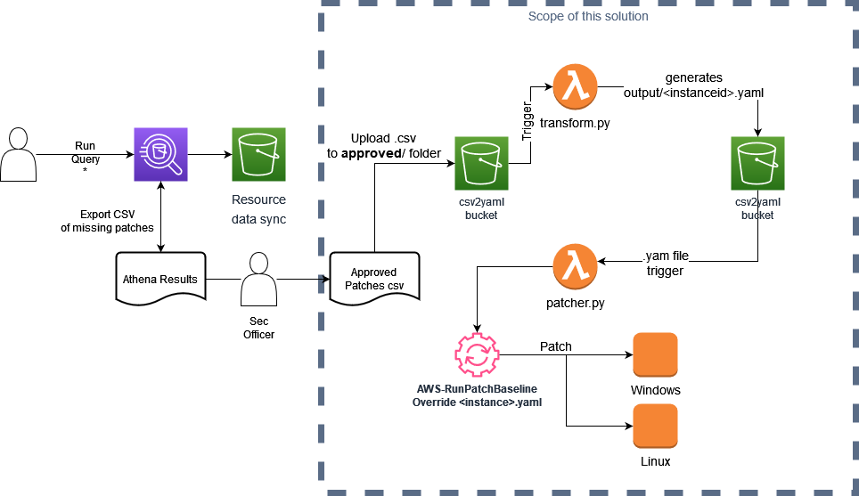

# csv-to-yaml
# Description
This project was build just to demonstrate how the generation of specific override to apply only specific patches to the instances and this files should ne consumed by Systems Manager AWS-RunPatchBaseline automation Document. 
More info [here](https://docs.aws.amazon.com/systems-manager/latest/userguide/override-list-scenario.html) on the usage and yaml structure.

## Architecture



## Deployment

Deploy this repo as a Standard SAM Application, steps are:

- Spin up a cloud9 instance. Instructions [here](https://docs.aws.amazon.com/cloud9/latest/user-guide/create-environment-main.html)
- Clone this repository using Cloud9's integrated shell
- Copy and paste the commands below.The interactive shell will guide you during the deployment.

```bash
git clone https://github.com/felipedbene/generate_override_list_yaml.git
cd Event-SAM/
sam deploy --guided
```
Once the deployment is sucessful, you should get an output similar to this one :
 
```
CloudFormation outputs from deployed stack
------------------------------------------------------------------------------------------------------------------------------------------------------------------------------------------------
Outputs                                                                                                                                                                                        
------------------------------------------------------------------------------------------------------------------------------------------------------------------------------------------------
Key                 S3Bucket                                                                                                                                                                   
Description         S3 Bucket for object storage.                                                                                                                                              
Value               csv2yaml-s3bucket-example                                                                                                                                            

Key                 TransformFunction                                                                                                                                                          
Description         TransformFunction ARN.                                                                                                                                                     
Value               csv2yaml-TransformFunction-example                                                                                                                                    

Key                 PatcherFunction                                                                                                                                                            
Description         PatcherFunction ARN.                                                                                                                                                       
Value               csv2yaml-PatcherFunction-example  
```

The S3Bucket in the output is the one expecting the approved patches files. That's it.


## Basic Usage 

Make sure Resource Invenory Data Sync is set up, run the query for the missing patches, example can be found [here](athena_query/sample_query.sql). 
If you not using this example query make sure the columns match as it's hardcoded in the lambda and it expects a certain format, be free contribute and improve it :-D.


There are also example reports in test_reports/ folders so you can get familiar with the expected format.

If you used Cloud9 to deploy the solution, just upload your own approved file into cloud9 and copy it to the generated bucket in the approved folder as follows:

```bash
aws s3 cp test_reports/test.csv s3://csv2yaml-s3bucket-12qbjm6ozou88/approved/sample.csv
```

or via gui, just upload a .csv file to the **approved/** folder and a few minutes later **output/{instance-id}.yaml** should be created and the patcher lambda should be triggered.

*Note: The instance profile must have IAM Access to this bucket, so it can download de baseline, otherwise patching will fail.

## Important disclaimer

This is meant to ilustrate how impleting two lambdas a manual process can be automated with little effort, **USE IT AS AN INSPIRATION** and not directly to production.
There's no error control for instance and the CSV format is static and can/has to be improved. Nor this has been extensively tested, be mindful of that.